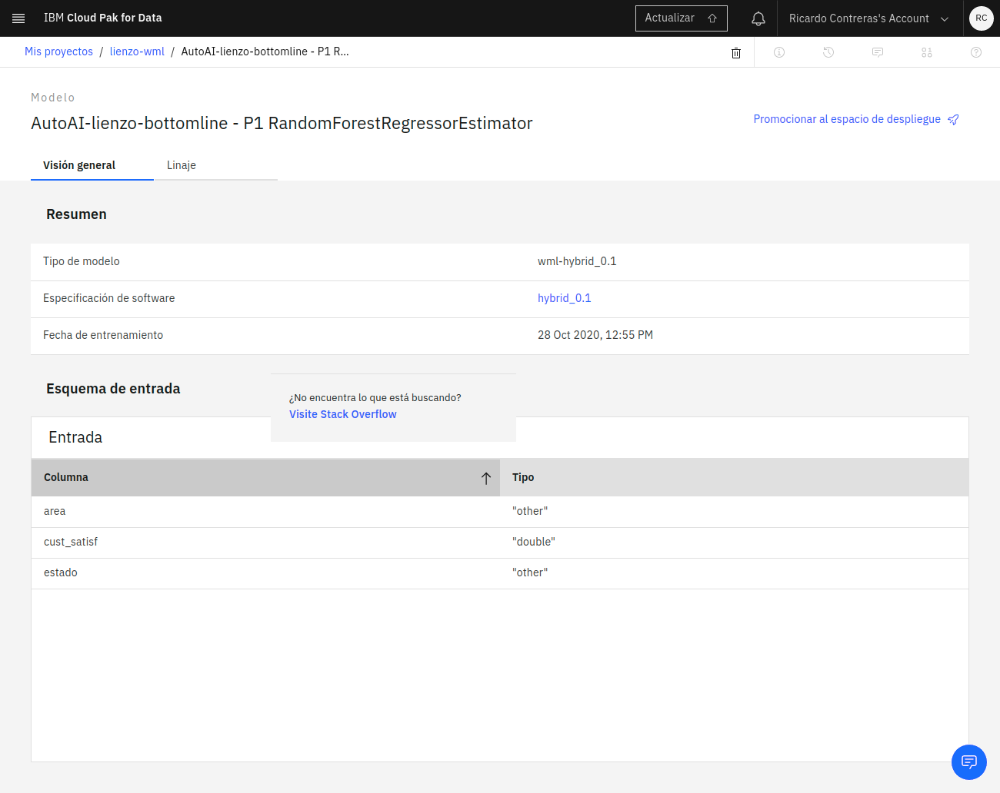
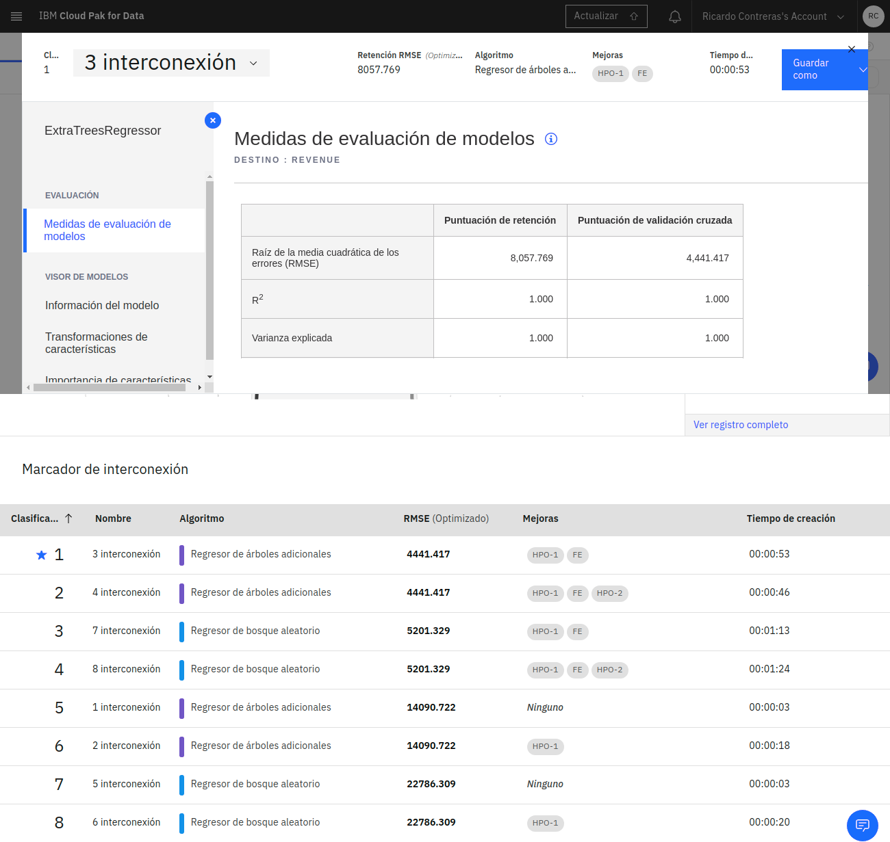

+++
date = "2016-11-05T21:05:33+05:30"
title = "Employee satisfy"
+++

Employee satisfy es la satisfacción del empleado, para predecir este dato nos valemos de las columnas "area" (que es un string), "employee_satisf" (que es un numero flotante), "cust_satisf" (que es un numero flotante) y "estado" (que es un string).

Este campo lo calculamos en através de los campos ya mencionados del archivo [data_bottomline.scv](../data_bottomline.csv), el archivo generado se llama [data_bottomline.csv_shaped](../data_bottomline.csv_shaped) se encuentra en la carpeta raíz o en el repositorio de [Github](https://github.com/rycko/lienzo.github.io)), también están los notebooks.

En el archivo [data_bottomline.csv_shaped](../data_bottomline.csv_shaped) tenemos las columnas "area", "employee_satisf", "cust_satisf" y "estado", la columna que se requiere predecir es "employee_satisf", este archivo se generó a partir de [data_bottomline.scv](../data_bottomline.csv), para obtener [data_bottomline.csv_shaped](../data_bottomline.csv_shaped) se refinó el archivo [data_bottomline.scv](../data_bottomline.csv) quitando todas las columnas que no aportán al modelo dejando solo las que ya se mencionarón anteriormente.

A partir del archivo [data_bottomline.csv_shaped](../data_bottomline.csv_shaped) se realizó un experimento AutoAI y de las interacciones generadas, se tomo la recomendada por el experimento para generar el modelo y los notebooks que se pueden encontrar en el repositorio de [Github](https://github.com/rycko/lienzo.github.io). 

## AutoAI experiment terminado

## Interconexión

___*Los archivos .csv se descargan automaticamente, los archivos .scvshaped aparecen como archivos de texto en la pantalla, todos los archivos se pueden consultar en el [repositoio](https://github.com/rycko/lienzo.github.io)*___
<!--more-->
