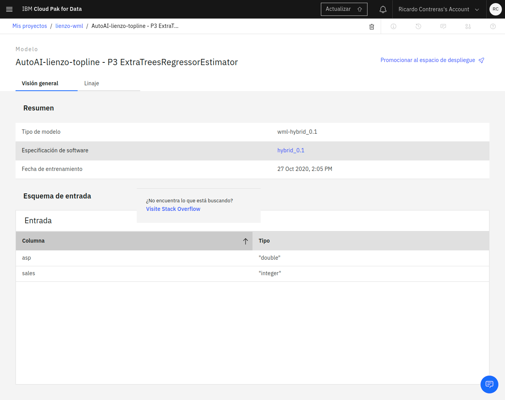
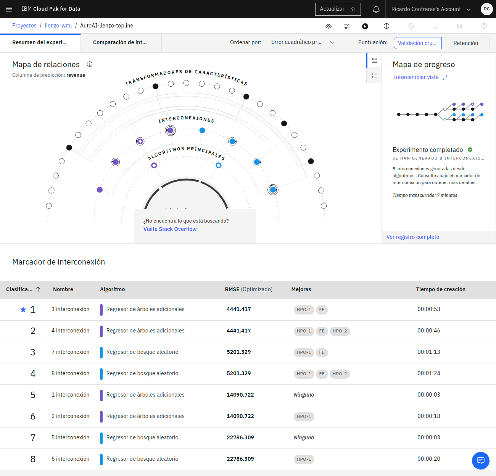
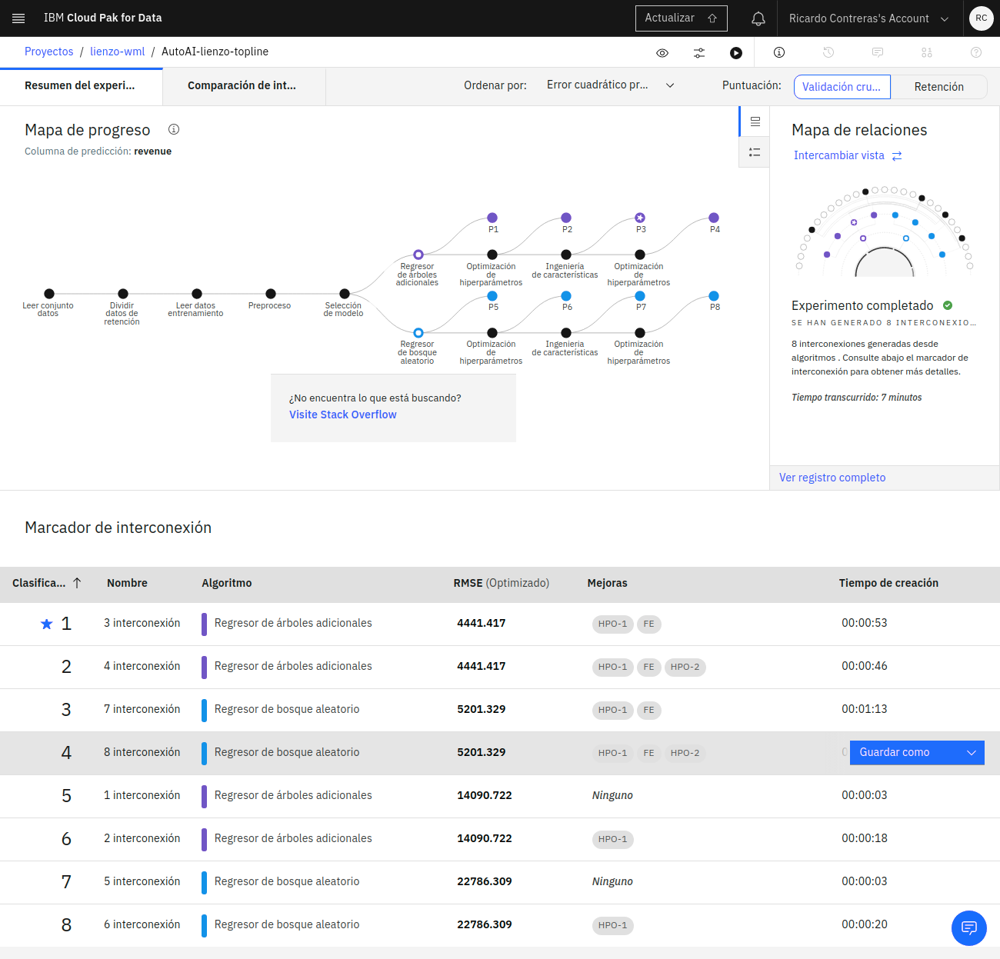

+++
date = "2016-11-05T21:05:33+05:30"
title = "revenue"
+++

Revenue es el ingreso por compras, se estima multiplicando el numero de ventas por el asp (average selling price).

EL revenue lo calculamos en através de los campos "sales" y "asp" del archivo [data_topline.csv](../data_topline.csv), los archivos csv generados en este ejercisio los encontramos en la carpeta raíz o en el repositorio de [Github](https://github.com/rycko/lienzo.github.io), también están los notebooks de los cuales uno requiere machine learning y el otro no.

En el archivo [data_topline.csv_shaped](../data_topline.csv_shaped) tenemos las columnas "sales", "revenue" y "asp", la columna que se requiere predecir es "revenue" ya que con los datos "sales" y "asp" podemos obtener este dato, este archivo se generó a partir de [data_topline.csv](../data_topline.csv), para obtener [data_topline.csv_shaped](../data_topline.csv_shaped) se refinó el archivo [data_topline.csv](../data_topline.csv) quitando todas las columnas que no aportán al modelo dejando solo las que ya se mencionarón anteriormente.

A partir del archivo [data_topline.csv_shaped](../data_topline.csv_shaped) se realizó un experimento AutoAI y de las interacciones generadas, se tomo la recomendada por el experimento para generar el modelo y los notebooks que se pueden encontrar en el repositorio de [Github](https://github.com/rycko/lienzo.github.io). 

## AutoAI experiment

## AutoAI experiment terminado

## AutoAI experiment terminado

___*Los archivos .csv se descargan automaticamente, los archivos .scvshaped aparecen como archivos de texto en la pantalla, todos los archivos se pueden consultar en el [repositoio](https://github.com/rycko/lienzo.github.io)*___
<!--more-->
